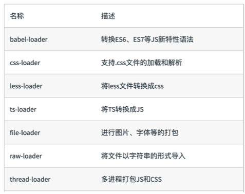

### webpack 配置文件
>默认配置文件：webpack.config.js  
>可通过 webpack --config 指定配置文件

**config -> Loaders**
> + webpack 开箱即用，它只支持 js 和 json 两种文件类型。但可通过 Loaders 去支持其它文件类型并把它们转化成有效的模块，并添加到依赖图中 
> + Loders 本身是一个函数，接受源文件作为参数，返回转换后的结果  
> + webpack 里常见的 Loaders: 
> + loaders 用法:[alt loaders 用法](../images/config_loaders02.png)

**config -> Plugins**
> + Plugins 用于打包文件 bundle 的优化，资源管理和环境变量注入
> + 作用于整个构建过程,常用的 plugins：[alt 常见的 plugins](../images/config_plugins01.png)  
> + plugins 的用法：[alt plugins用法](../images/config_plugins02.png)

**config -> mode**
> + mode 用于指定当前的构建环境，常见的有:  
    - production 
    - development
    - none
> + 设置了 mode 后，就可以使用 webpack 内置的函数了，默认值 production
> + mode 内置函数的功能: [alt mode选项描述](../images/config_mode01.png)